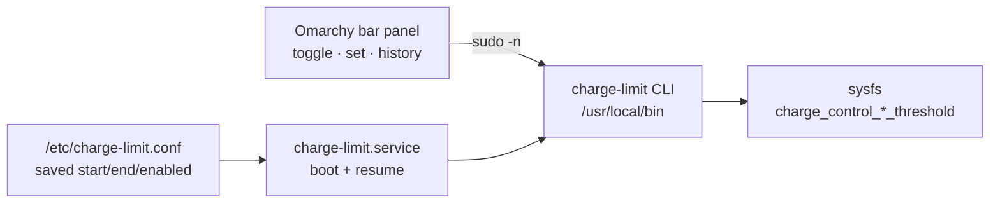

<p align="center">
  
</p>

<h1 align="center">Charge Limit for Omarchy</h1>

<p align="center">
  Toggle your laptop battery charge limit from the Omarchy bar.
</p>

## Features

- Battery widget in the bar that reflects the current charge-limit state.
- One-click toggle between a protective limit (e.g. 75/80) and full charge (0/100), so you can top up to 100% before leaving and re-apply the limit when you get back.
- Edit the start/stop thresholds from the panel.
- A 24-hour battery-level history, with charging periods highlighted and the saved limit drawn as a reference line.
- The saved limit is re-applied on every boot and resume, because the ThinkPad EC resets thresholds to 0/100 when power is cut.

## How it works

The plugin is a thin UI over a small privileged CLI (`charge-limit`) that writes the kernel's `charge_control_{start,end}_threshold` sysfs attributes. A oneshot systemd unit re-applies the saved limit on boot and after suspend/hibernate.



Reads (status, history) need no privileges: the panel reads sysfs and UPower directly. Only writes (toggle, set, on/off) go through `sudo -n`, scoped by a sudoers rule to just the `charge-limit` subcommands.

## Requirements

- A laptop whose kernel exposes `charge_control_start_threshold` and `charge_control_end_threshold` under `/sys/class/power_supply/BAT0` (ThinkPads and many others).
- Omarchy with shell plugin support.
- `systemd`, `sudo`, and `polkit`/`visudo` for the one-time system install.

## Install

Two parts: the privileged CLI/service (once), then the plugin.

1. Install the system side (CLI, boot/resume service, scoped sudoers rule):

```bash
git clone https://github.com/POSO-PocketSolutions/omarchy-charge-limit.git
cd omarchy-charge-limit
./system/install.sh
sudo charge-limit set 75 80
```

`install.sh` re-runs itself with `sudo` and targets your user in the sudoers rule, so run it as your normal user.

2. Install the plugin into the bar:

```bash
omarchy plugin add https://github.com/POSO-PocketSolutions/omarchy-charge-limit.git --enable --yes
```

Optional settings:

```bash
omarchy bar set io.github.mnsosa.charge-limit refreshIntervalSec 30 --json
omarchy bar set io.github.mnsosa.charge-limit limitedColor '"#3fb950"' --json
omarchy bar set io.github.mnsosa.charge-limit fullColor '"#d29922"' --json
```

## Usage

- Click the battery widget to open the panel.
- Use the toggle to charge to 100% now, or re-apply the saved limit.
- Open the editor to change the start/stop thresholds.

From a terminal the same CLI is available:

```bash
charge-limit status
sudo charge-limit set 75 80   # set and persist
sudo charge-limit full        # charge to 100% now (temporary)
sudo charge-limit on          # re-apply the saved limit
sudo charge-limit off         # disable the limit entirely
sudo charge-limit toggle      # switch full <-> saved limit
```

## Remove

```bash
omarchy plugin remove io.github.mnsosa.charge-limit --yes
./system/uninstall.sh
```

`uninstall.sh` releases the limit to 0/100, then disables and removes the
service, the CLI, the sudoers rule, and `/etc/charge-limit.conf`.

## Development

```bash
python -m unittest discover -s tests -v
omarchy plugin validate .
```

## License

MIT © Matías Sosa
